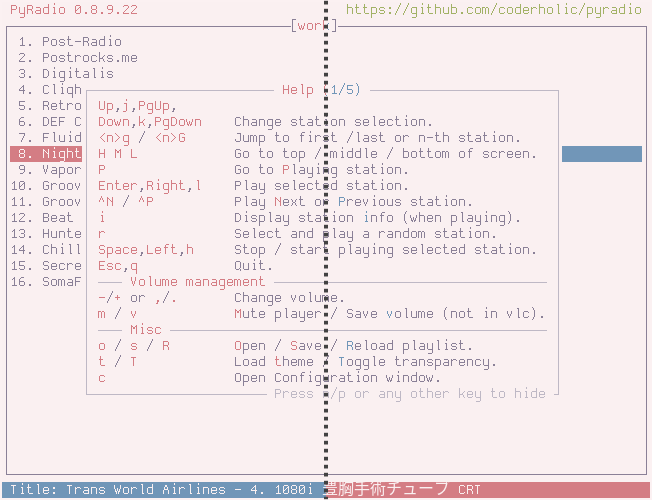
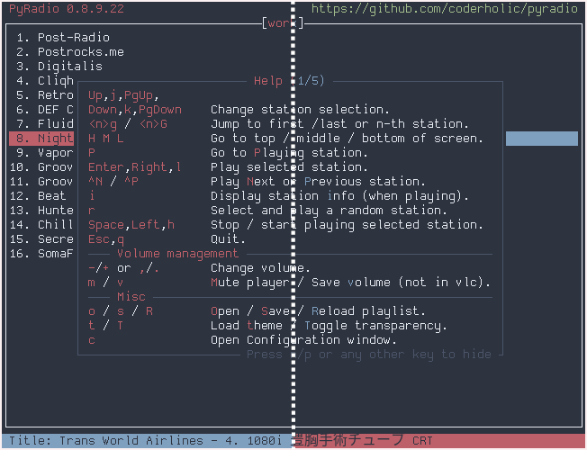
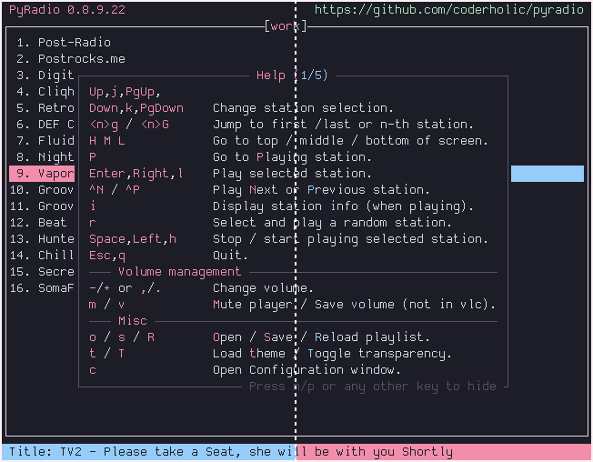
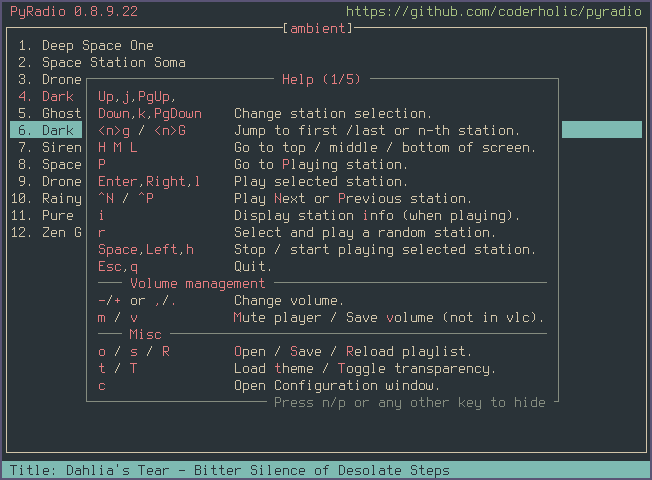
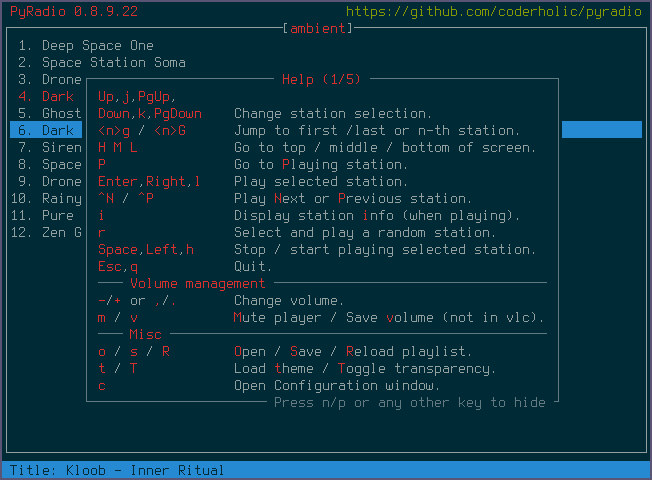

# base16-pyradio
This repo contains a set of theme files and templates for internet radio player [pyradio](https://github.com/coderholic/pyradio) meant to work with any [base16 builder](https://github.com/base16-project/base16).

Prebuilt themes have been built using [base16-builder-node](https://github.com/base16-project/base16-builder-node), and can be found in the `themes/` directory. For detailed build and installation instructions, see [Installation](#installation).

## Installation
### Install a theme
To install individual themes, copy the desired `.pyradio-theme`-file in `themes/` to `~/.config/pyradio/themes/`, or use `curl`:

```
mkdir -p ~/.config/pyradio/themes
curl https://raw.githubusercontent.com/edunfelt/base16-pyradio/master/themes/base16-default-dark.pyradio-theme -o ~/.config/pyradio/themes/base16-default-dark.pyradio-theme
```

### Build themes
#### Requirements
- [base16-builder-node](https://github.com/base16-project/base16-builder-node)
- [Make](https://www.gnu.org/software/make/)

#### Instructions
```
git clone git@github.com:edunfelt/base16-pyradio.git
cd base16-pyradio
make
```

## Contributing
Contributions are welcome and greatly appreciated!

## Screenshots
**cupcake**



**nord**



**catppuccin**



**everforest**



**solarized-dark**




## Cycling through the themes

To see all the themes provided by this repo, follow this procedure

```
mkdir -p ~/.config/pyradio/themes
touch ~/.config/pyradio/themes/cycle_pyradio_themes.pyradio-theme
```

Create a new file anywhere in you PATH, in `~/.lobal/bin` for example, and name it `cycle_pyradio_themes`

```
touch ~/.local/bin/cycle_pyradio_themes
```

Open it in a text editor and paste the following in it:

```
#!/bin/bash
if [ $(basename "$PWD") != "themes"  ]
then
    echo "Run this script in the \"themes\" dir only!"
    exit 1
fi
ALL=$(ls -1 *.pyradio-theme 2>/dev/null| wc -l)
while true
do
    clear
    COUNT=1
    for n in *.pyradio-theme
    do
        if [ -e "$n" ]
        then
            printf '%3s/%s. ' $COUNT $ALL
            echo ${n/.*/}
            ((COUNT++))
            \cp "$n" ~/.config/pyradio/themes/cycle_pyradio_themes.pyradio-theme
            sleep 2.5
        else
            echo "File not found!!!"
            exit 1
        fi
    done
done
```

Finally, make it executable:

```
chmod +x ~/.local/bin/cycle_pyradio_themes
```

Obviously, you will have to use the file location you used when you created the file.

Open two terminals and place them side by side.

In the first one execute `pyradio`, press "**t**" and select the theme named `cycle_pyradio_themes` and press "**c**".

In the second terminal execute `cycle_pyradio_themes`

Enjoy!
