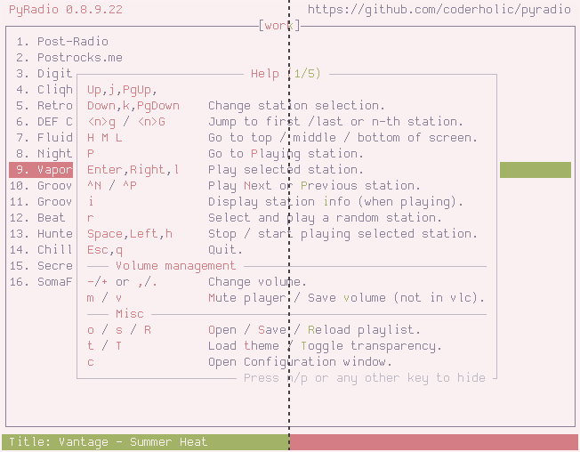
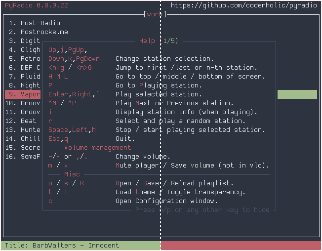
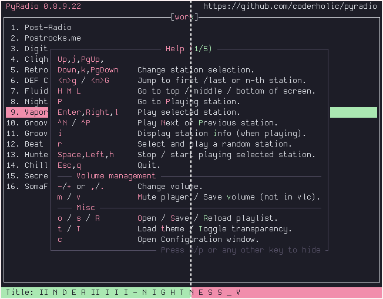
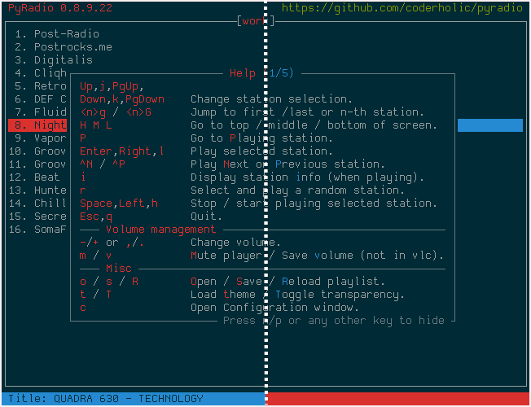
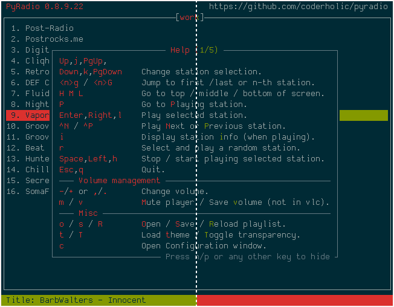
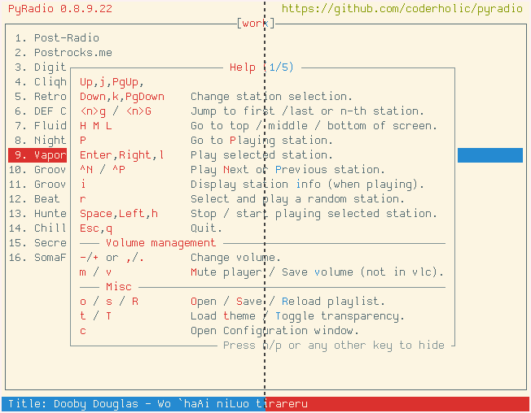
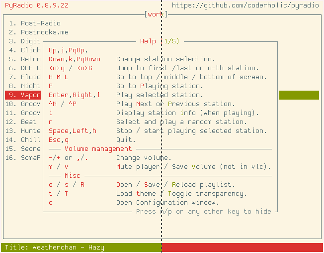

# base16-pyradio
This repo contains 4 sets of theme files and templates for internet radio player [pyradio](https://github.com/coderholic/pyradio) meant to work with any [base16 builder](https://github.com/base16-project/base16).

Prebuilt themes have been built using [base16-builder-node](https://github.com/base16-project/base16-builder-node), and can be found in the `themes/` directory. For detailed build and installation instructions, see [Installation](#installation).

## Installation
### Install a theme manually
To install individual themes, copy the desired `.pyradio-theme`-file in any of the directories under `themes/` to `~/.config/pyradio/themes/`, or use `curl`:

```
mkdir -p ~/.config/pyradio/themes
curl https://raw.githubusercontent.com/edunfelt/base16-pyradio/master/themes/default/base16-default-dark.pyradio-theme -o ~/.config/pyradio/themes/base16-default-dark.pyradio-theme
```

### Using the themes without base16-shell

The best way to use the themes is to install and set up [base16-shell](https://github.com/base16-project/base16-shell), (in which case no theme installation is necessary), but this is not mandatory.

To use the themes (without installing and using **base16-shell**) one would just have to clone this repo (or download the zip file), and copy the themes to `~/.config/pyradio/themes`.

One might just want to test the themes, by copying one of the directories to `~/.config/pyradio/themes`, for example

    cp themes/variation/* ~/.config/pyradio/themes

to "install" and test the variation set of the themes.

Consecutive use of this command (using a different source directory) will just overwrite any previously copied themes.

To copy all the themes, or all themes in a folder, just use the following script.

    python install_themes.py

**Notice:** this will copy more than **900 files** in the target directory... You've been warned...

Here is its help screen

```
usage: install_themes.py [-h] [-a] [-d] [-l] [-r] [-t] [-u]

Install PyRadio Base16 themes

options:
  -h, --help           show this help message and exit
  -a, --all            install all themes
  -d, --default        install default themes only
  -l, --default-alt    install default alternative themes only
  -r, --variation      install variation themes only
  -t, --variation-alt  install variation alternative themes only
  -u, --uninstall      uninstall themes (to be used with one of the previous
                       options)
```


### Build themes
#### Requirements

- [base16-builder-node](https://github.com/base16-project/base16-builder-node)
- [Make](https://www.gnu.org/software/make/)

#### Instructions

```
mkdir -p base16/templates && cd base16/templates
git clone git@github.com:edunfelt/base16-pyradio.git
cd base16-pyradio
make
```


## Cycling through the themes

To see all the themes provided by this repo, just use this theme:


    python cycle_themes.py

and follow the instructions within.

Here is its help screen

```
usage: cycle_themes.py [-h] [-s START] [-d DELAY]

Cycle through PyRadio Base16 themes

options:
  -h, --help            show this help message and exit
  -s START, --start START
                        start with theme number
  -d DELAY, --delay DELAY
                        counter delay
```

Enjoy!

## Contributing

Contributions are welcome and greatly appreciated!


## Screenshots
Left side shows the `default` themes, right side shows `variant` themes.

**cupcake**

<p align="center">
    
    
</p>

**nord**

<p align="center">
    
    
</p>

**catppuccin**

<p align="center">
    
    
</p>


**solarized-dark**

<p align="center">
    
    
</p>


**solarized-light**

<p align="center">
    
    
</p>
