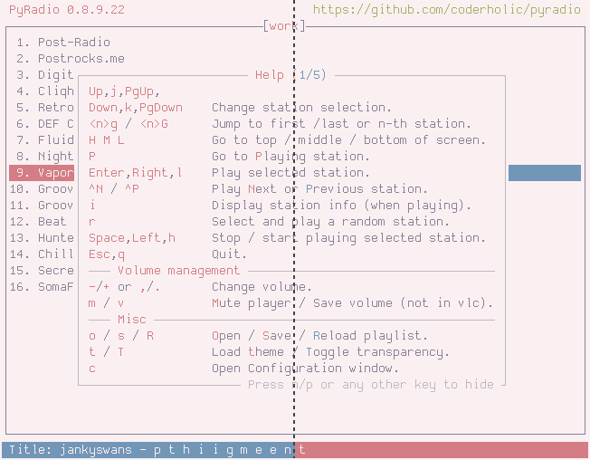
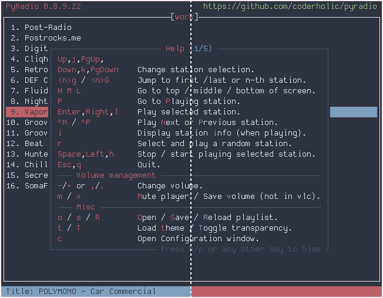
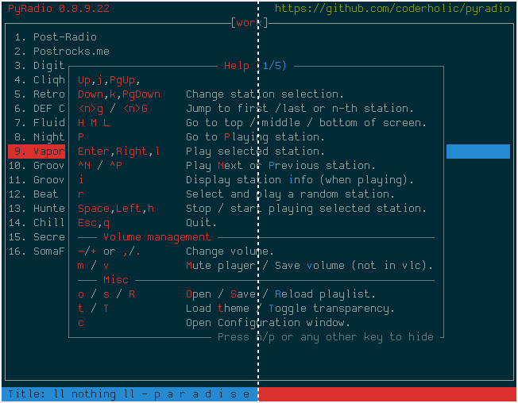

# base16-pyradio
This repo contains 4 sets of theme files and templates for internet radio player [pyradio](https://github.com/coderholic/pyradio) meant to work with any [base16 builder](https://github.com/base16-project/base16).

Prebuilt themes have been built using [base16-builder-node](https://github.com/base16-project/base16-builder-node), and can be found in the `themes/` directory. For detailed build and installation instructions, see [Installation](#installation).

## Installation
### Install a theme manually
To install individual themes, copy the desired `.pyradio-theme`-file in any of the directories under `themes/` to `~/.config/pyradio/themes/`, or use `curl`:

```
mkdir -p ~/.config/pyradio/themes
curl https://raw.githubusercontent.com/edunfelt/base16-pyradio/master/themes/default/base16-default-dark.pyradio-theme -o ~/.config/pyradio/themes/base16-default-dark.pyradio-theme
```

### Using the themes without base16-shell

The best way to use the themes is to install and set up [base16-shell](https://github.com/base16-project/base16-shell), (in which case no theme installation is necessary), but this is not mandatory.

To use the themes (without installing and using **base16-shell**) one would just have to clone this repo (or download the zip file), and copy the themes to `~/.config/pyradio/themes`.

One might just want to test the themes, by copying one of the directories to `~/.config/pyradio/themes`, for example

    cp themes/variation/* ~/.config/pyradio/themes

to "install" and test the variation set of the themes.

Consecutive use of this command (using a different source directory) will just overwrite any previously copied themes.

To copy all the themes, or all themes in a folder, just use the following script.

    python install_themes.py

**Notice:** this will copy more than **900 files** in the target directory... You've been warned...

Here is its help screen

```
usage: install_themes.py [-h] [-a] [-d] [-l] [-r] [-t] [-u]

Install PyRadio Base16 themes

options:
  -h, --help           show this help message and exit
  -a, --all            install all themes
  -d, --default        install default themes only
  -l, --default-alt    install default alternative themes only
  -r, --variation      install variation themes only
  -t, --variation-alt  install variation alternative themes only
  -u, --uninstall      uninstall themes (to be used with one of the previous
                       options)
```

And here is the actual script

**install_themes.py**
```
import os
import sys
from argparse import ArgumentParser
from glob import glob
from time import sleep
import shutil
import curses

def install_themes(scr, target, what, uninstall):
    to_copy = what
    action = 'deleting' if uninstall else 'copying'
    last_action = 'deleted' if uninstall else 'copied'
    scr.addstr(1, 0, 'Target folders: "{}"'.format(target), curses.color_pair(0))
    scr.addstr(2, 0, 'Input folders:', curses.color_pair(0))
    for a_dir_count, a_dir in enumerate(to_copy):
        files = glob(os.path.join('themes', a_dir, '*.pyradio-theme'))
        file_count = 0
        for count in range(0, len(files)):
            Y, X = scr.getmaxyx()
            if not uninstall:
                s_file = os.path.basename(files[count])
            to_file = os.path.basename(files[count]).replace('.pyradio-theme', '') + '-' + a_dir + '.pyradio-theme'
            to_file_path = os.path.join(target, to_file)
            if uninstall:
                try:
                    os.remove(to_file_path)
                    file_count += 1
                except:
                    pass
            else:
                try:
                    shutil.copy(files[count], to_file_path)
                    file_count += 1
                except:
                    pass
            scr.addstr(a_dir_count + 3, 0, '  {0}: {1} file {2}/{3}'.format(a_dir, action, file_count, len(files)), curses.color_pair(0))
            scr.clrtoeol()
            if uninstall:
                msg = '    {}'.format(to_file)[:X]
            else:
                msg = '    {0} -> {1}'.format(s_file, to_file)[:X]
            scr.addstr(a_dir_count + 4, 0, msg, curses.color_pair(0))
            try:
                scr.clrtoeol()
            except:
                pass
            scr.refresh()
            sleep(0.01)
        scr.addstr(a_dir_count + 3, 0, '  {0}: files {1}: {2}/{3}'.format(a_dir, last_action, file_count, len(files)), curses.color_pair(0))
        scr.clrtoeol()

    scr.addstr(a_dir_count + 4, 0, 'Press any key to exit curses...')
    scr.clrtoeol()
    scr.refresh()
    scr.getch()

def make_target(uninstall):
    if sys.platform.startswith('win'):
        target = os.path.join(os.getenv('appdata'), 'pyradio', 'themes')
    else:
        target = os.path.join(os.getenv('HOME', '~'), '.config', 'pyradio', 'themes')

    if not os.path.exists(target) and uninstall:
        print('Nothing to uninstall...\n')
        sys.exit(1)

    if not os.path.exists(target):
        os.makedirs(target)
    if not os.path.exists(target):
        print(1, 0, 'Error: Cannot create output folder: "{}"\n\n'.format(target))
        sys.exit(1)
    return target

parser = ArgumentParser(description='Install PyRadio Base16 themes')
parser.add_argument('-a', '--all', action='store_true',
                    help='install all themes')
parser.add_argument('-d', '--default', action='store_true',
                    help='install default themes only')
parser.add_argument('-l', '--default-alt', action='store_true',
                    help='install default alternative themes only')
parser.add_argument('-r', '--variation', action='store_true',
                    help='install variation themes only')
parser.add_argument('-t', '--variation-alt', action='store_true',
                    help='install variation alternative themes only')
parser.add_argument('-u', '--uninstall', action='store_true',
                    help='uninstall themes (to be used with one of the previous options)')
args = parser.parse_args()

directory_path = os.getcwd()
if not os.path.exists('themes'):
    print('Cannot find the "themes" folder...\n')
    sys.exit(1)

if args.all or args.default or \
        args.default_alt or \
        args.variation or \
        args.variation_alt:
    ''' install themes '''

    target = make_target(args.uninstall)

    if args.uninstall:
        print('PyRadio Base16 themes uninstalled!\n')
    else:
        print('PyRadio Base16 themes installed!\n')

    ''' start curses '''
    scr = curses.initscr()
    curses.start_color()
    curses.use_default_colors()
    try:
        curses.curs_set(0)
    except:
        pass
    scr.nodelay(0)
    curses.noecho()
    curses.cbreak()

    if args.uninstall:
        scr.addstr(0, 0, 'Uninstalling PyRadio Base16 themes', curses.color_pair(0))
    else:
        scr.addstr(0, 0, 'Installing PyRadio Base16 themes', curses.color_pair(0))

    if args.all:
        what = ['default', 'default-alt', 'variation', 'variation-alt']
    else:
        what = []
        if args.default:
            if 'default' not in what:
                what.append('default')
        if args.default_alt:
            if 'default-alt' not in what:
                what.append('default-alt')
        if args.variation:
            if 'variation' not in what:
                what.append('variation')
        if args.variation_alt:
            if 'variation-alt' not in what:
                what.append('variation-alt')
    install_themes(scr, target, what, args.uninstall)
    curses.endwin()
else:
    ''' print help '''
    parser.print_help(sys.stdout)
```

### Build themes
#### Requirements

- [base16-builder-node](https://github.com/base16-project/base16-builder-node)
- [Make](https://www.gnu.org/software/make/)

#### Instructions

```
mkdir -p base16/templates && cd base16/templates
git clone git@github.com:edunfelt/base16-pyradio.git
cd base16-pyradio
make
```


## Cycling through the themes

To see all the themes provided by this repo, follow this procedure:

Create a new file within this repo and name it `cycle_themes.py`.

```
touch cycle_themes.py
```

Open it in a text editor and paste the following in it:

```
import os
import sys
from time import sleep
import shutil
import curses
import threading
from glob import glob
from argparse import ArgumentParser
try:
    import queue
except:
    import Queue as queue

win = None

def print_msg(msg):
    win.move(0, 0)
    win.insdelln(1)
    win.addstr(msg, curses.color_pair(0))
    win.refresh()

def make_target():
    if sys.platform.startswith('win'):
        target = os.path.join(os.getenv('appdata'), 'pyradio', 'themes')
    else:
        target = os.path.join(os.getenv('HOME', '~'), '.config', 'pyradio', 'themes')

    if not os.path.exists(target):
        os.makedirs(target)
    if not os.path.exists(target):
        print(1, 0, 'Error: Cannot create output folder: "{}"\n\n'.format(target))
        sys.exit(1)
    target = os.path.join(target, 'cycle_base16_themes.pyradio-theme')
    ''' reset the file '''
    try:
        with open(target, 'w') as f:
            pass
    except:
        print(1, 0, 'Error: Cannot create output file: "{}"\n\n'.format(target))
        sys.exit(1)
    return target

def copy_a_theme(scr, in_file, out_file, a_dir):
    o_file = os.path.join(os.path.dirname(out_file), os.path.basename(in_file).replace('.pyradio-theme', '-' + a_dir + '.pyradio-theme'))
    try:
        shutil.copy(in_file, o_file)
        print_msg('Theme copyied: {}'.format(os.path.basename(o_file)).replace('.pyradio-theme', ''))
    except:
        print_msg('Theme copy failed: {}'.format(os.path.basename(o_file)).replace('.pyradio-theme', ''))

def copy_theme_group(scr, in_file, out_file, dirs):
    theme_name = os.path.basename(in_file).replace('.pyradio-theme', '')
    for n in dirs:
        theme_name = theme_name.replace(n, '')
    # print_msg('theme_name: {}'.format(theme_name))

    in_list = []
    out_list = []
    error = False
    for n in dirs:
        in_list.append(os.path.join('themes', n, theme_name + '.pyradio-theme'))
        out_list.append(os.path.join(os.path.dirname(out_file), theme_name + '-' + n + '.pyradio-theme'))
        # print_msg('in: ' + in_list[-1])
        # print_msg('out: ' + out_list[-1])
        try:
            shutil.copy(in_list[-1], out_list[-1])
        except:
            error = True
    if error:
        print_msg('Theme group copy failed: ' + theme_name)
    else:
        print_msg('Theme group copyied: ' + theme_name)


def do_copy_files(scr, out_file, stop, delay, th_start_count, que):
    ''' thread to copy files to out file '''
    start_count = int(th_start_count / 4)
    scr.clrtoeol()
    dirs = (
        'default',
        'default-alt',
        'variation',
        'variation-alt'
    )
    files = glob(os.path.join('themes', 'default', '*.pyradio-theme'))
    files.sort()
    y, x = scr.getmaxyx()
    msg = ' Available commands:'
    scr.addstr(8, 0, msg.ljust(x), curses.A_REVERSE)
    msg = ' Total number of themes: {0}, delay: {1} sec'.format(4 * len(files), delay())
    scr.addstr(1, 0, msg.ljust(x), curses.A_REVERSE)
    scr.addstr(0, 0, ' Cycle PyRadio Base16 Themes', curses.A_BOLD)

    end_count = len(files)
    scr.clrtoeol()
    while True:
        max_len = len(str(len(files)))
        for i in range(start_count, end_count):
            for n in range(0, 4):
                num = str(4 * i + n + 1)

                scr.addstr(n+3, 0, '   ' + num.rjust(max_len)  + '. ' + os.path.basename(files[i]).replace('.pyradio-theme', '') + '-' + dirs[n], curses.color_pair(0))
                scr.clrtoeol()
                if stop():
                    return
            scr.refresh()
            ''' delete all ticks '''
            for n in range(0, 4):
                scr.addstr(n + 3, 1, ' ', curses.color_pair(0))
            for n in range(0, 4):
                # scr.addstr(n + 3, 1, '>', curses.color_pair(0))
                scr.addstr(n + 3, 1, '>', curses.A_BOLD)
                if n > 0:
                    scr.addstr(n + 2, 1, ' ', curses.color_pair(0))
                ''' copy file '''
                in_file = os.path.join('themes', dirs[n], os.path.basename(files[i]))
                shutil.copy(in_file, out_file)

                y, x = scr.getmaxyx()
                msg = ' Available commands:'
                scr.addstr(8, 0, msg.ljust(x), curses.A_REVERSE)
                msg = ' Total number of themes: {0}, delay: {1} sec'.format(4 * len(files), delay())
                scr.addstr(0, 0, ' Cycle PyRadio Base16 Themes', curses.A_BOLD)
                scr.addstr(1, 0, msg.ljust(x), curses.A_REVERSE)

                msg = '''   + / .    Increase delay
   - / ,    Decrease delay
   c , C    Copy theme by name / group
   q        Exit
'''
                scr.addstr(9, 0, msg, curses.color_pair(0))

                for l in range(9, 13):
                    for k in 3, 7:
                        scr.chgat(l, k, 1, curses.A_BOLD)

                msg = ' Messages:'
                scr.addstr(14, 0, msg.ljust(x), curses.A_REVERSE)

                scr.refresh()
                step = int(delay() / .2) + 1
                for _ in range(0, step):
                    sleep(.2)
                    try:
                        command = que.get(block=False)
                    except queue.Empty:
                        command = None
                    if command is not None:
                        if command == ord('c'):
                            copy_a_theme(scr, in_file, out_file, dirs[n])
                        elif command == ord('C'):
                            copy_theme_group(scr, in_file, out_file, dirs)
                    if stop():
                        return
                if stop():
                    return
        start_count = 0
        if stop():
            return

parser = ArgumentParser(description='Cycle through PyRadio Base16 themes')
parser.add_argument('-s', '--start',
                    help='start with theme number')
parser.add_argument('-d', '--delay',
                    help='counter delay')
args = parser.parse_args()

''' start curses '''
scr = curses.initscr()
curses.start_color()
curses.use_default_colors()
try:
    curses.curs_set(0)
except:
    pass
scr.nodelay(0)
curses.noecho()
curses.cbreak()

start_count = 0
if args.start:
    try:
        start_count = int(args.start) - (int(args.start) % 4)
    except:
        pass
delay = 2
if args.delay:
    try:
        delay = float(args.delay)
    except:
        pass

out_file = make_target()

msg =  '''Please execute PyRadio now and "watch" the "cycle_base16_themes" theme

To do that:
  1. Execute PyRadio
  2. Press "t" to open the "Themes Selection" window
  3. Select the "cycle_base16_themes" entry
  4. Press "c" to watch it
  5. Press "ESCAPE" to close the "Themes Selection" window

When you are ready, please press any key to continue...


Parameters:
  Start counter: {0}
  Counter delay: {1} sec
'''

scr.addstr(0, 0, msg.format(start_count, delay), curses.color_pair(0))
scr.refresh()
scr.getch()
scr.clear()
scr.refresh()

y, x = scr.getmaxyx()
win = curses.newwin(y-15, x, 15, 0)
print_msg('Program started...')
que = queue.Queue()

stop_thread = False
copy_thread = threading.Thread(
    target=do_copy_files,
    args=(
        scr,
        out_file,
        lambda: stop_thread,
        lambda: delay,
        start_count,
        que
    )
)
copy_thread.start()

while True:
    char = scr.getch()
    if char == ord('q'):
        stop_thread = True
        break
    elif char in (ord('+'), ord('.')):
        delay = round(delay + .1, 1)
        print_msg('Delay increased by .1 sec...')
    elif char in (ord('-'), ord(',')):
        if delay > .5:
            delay = round(delay - .1, 1)
            print_msg('Delay decreased by .1 sec...')
    elif char in (ord('c'), ord('C')):
        try:
            que.put(char, block=False)
        except queue.Full:
            pass


print_msg('Waiting for threads to terminate...')
copy_thread.join()
curses.endwin()
os.remove(out_file)
```

Finally, execute it in a terminal:

    python cycle_themes.py

and follow the instructions within.

Here is its help screen

```
usage: cycle_themes.py [-h] [-s START] [-d DELAY]

Cycle through PyRadio Base16 themes

options:
  -h, --help            show this help message and exit
  -s START, --start START
                        start with theme number
  -d DELAY, --delay DELAY
                        counter delay
```

Enjoy!


## Contributing

Contributions are welcome and greatly appreciated!


## Screenshots
Left side shows the `default` themes, right side shows `variant` themes.

**cupcake**

<p align="center">
    
    
</p>

**nord**

<p align="center">
    
    
</p>

**catppuccin**

<p align="center">
    
    
</p>


**solarized-dark**

<p align="center">
    
    
</p>


**solarized-light**

<p align="center">
    
    
</p>
